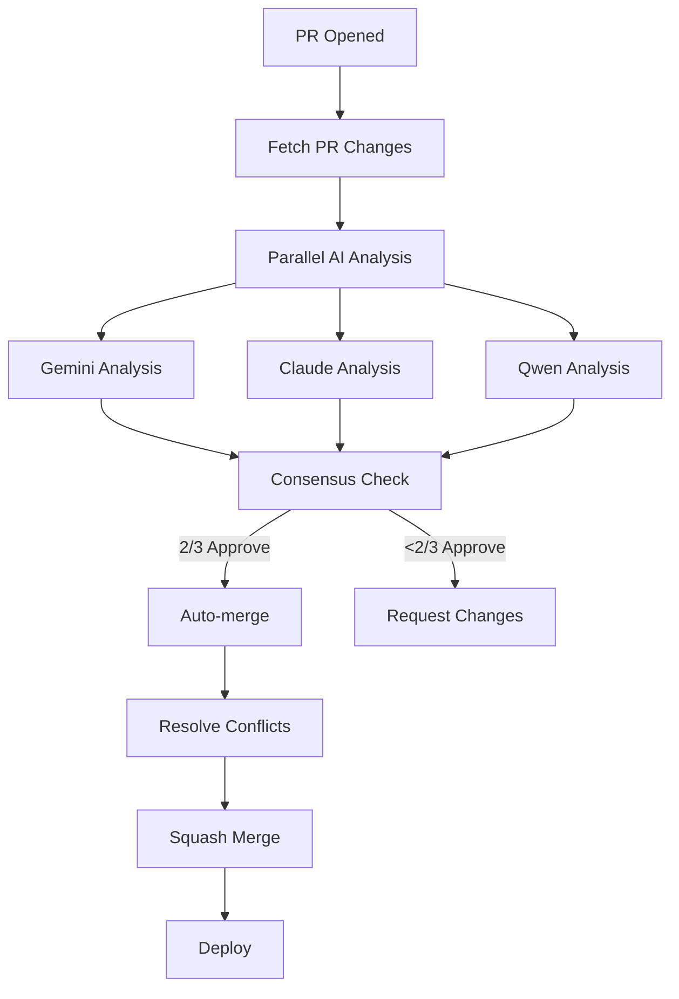

# Automated Pull Request Management

Complete guide to automated PR analysis, bug fixing, and merging using the AI Brain system.

## 🎯 Overview

The Istani project uses an **AI Brain** system that automatically:

- ✅ Analyzes pull requests with multiple AI providers
- 🔍 Detects bugs and issues
- 🛠️ Suggests or applies fixes
- 🤝 Requires consensus (2/3 AI approval)
- 🚀 Auto-merges approved changes
- ⚡ Resolves merge conflicts automatically

## 📊 Current Repository Status

**As of 2025-11-10**: The repository has **105+ feature branches** from various AI assistants:

- **Codex branches**: ~100 branches
- **Copilot branches**: ~5 branches
- **Claude branches**: ~5 branches

## 🤖 How AI Brain Works

### 1. Multi-AI Analysis

Every PR is analyzed by **3 AI providers** simultaneously:

| Provider             | Model                        | Strengths                |
| -------------------- | ---------------------------- | ------------------------ |
| **Google Gemini**    | `gemini-pro`                 | Fast, broad knowledge    |
| **Anthropic Claude** | `claude-3-5-sonnet-20241022` | Code analysis, reasoning |
| **Alibaba Qwen**     | `qwen-max`                   | Alternative perspective  |

### 2. Consensus-Based Approval

```
PR Approval = 2 out of 3 AI providers approve
```

- If ≥2 AIs approve → Auto-merge
- If <2 AIs approve → Request changes
- Conflicts resolved automatically when possible

### 3. Automated Workflow



## 🔧 Tools & Commands

### Branch Analyzer

Analyze all feature branches to identify merge status:

```bash
# Analyze all branches
node ai-brain/pr-analyzer.js --analyze

# Analyze specific branch
node ai-brain/pr-analyzer.js --branch codex/add-adsense-meta-tag

# Generate report
node ai-brain/pr-analyzer.js --analyze > report.txt
```

**Output includes**:

- Total branches by source (codex, copilot, claude)
- Merge status (clean, conflicts, errors)
- Recommendations for merging
- Detailed JSON report

### Health Check

Validate your AI configuration:

```bash
node config/health-check.js
```

**Checks**:

- All API keys configured
- Services enabled
- System health status

## 📋 Managing 105+ Feature Branches

### Strategy for Handling Many Branches

#### Phase 1: Analysis (Recommended First Step)

```bash
# 1. Fetch all branches
git fetch origin --prune

# 2. Analyze all branches
node ai-brain/pr-analyzer.js --analyze

# 3. Review generated report
cat ai-brain/pr-analysis-report.json | jq
```

This will categorize branches into:

- **Clean**: Ready to merge (no conflicts)
- **Conflicts**: Need manual resolution
- **Error**: Unable to analyze

#### Phase 2: Merge Clean Branches

For branches with **no conflicts**, you can safely merge:

```bash
# Create a batch merge script
cat > batch-merge.sh << 'EOF'
#!/bin/bash

CLEAN_BRANCHES=(
  # Add clean branch names from analysis
  "origin/branch-name-1"
  "origin/branch-name-2"
)

for branch in "${CLEAN_BRANCHES[@]}"; do
  echo "Merging $branch..."
  git merge --squash "$branch"
  git commit -m "chore: merge $branch"
done
EOF

chmod +x batch-merge.sh
```

#### Phase 3: Handle Conflict Branches

For branches with conflicts:

1. **Manual Review**: Check what changed
2. **Conflict Resolution**: Use AI assistance
3. **Test**: Verify changes work
4. **Merge**: Use consensus approval

#### Phase 4: Clean Up Stale Branches

```bash
# List branches older than 90 days
git for-each-ref --sort=committerdate refs/remotes/ --format='%(committerdate:short) %(refname:short)'

# Delete stale branches (after backup)
git push origin --delete branch-name
```

## 🚀 GitHub Actions Workflow

### Automatic Triggers

The AI Brain runs automatically on:

- `pull_request: opened` - New PR created
- `pull_request: synchronize` - PR updated
- `pull_request: reopened` - PR reopened

### Manual Trigger

You can also trigger manually from GitHub Actions UI:

1. Go to: https://github.com/sano1233/istani/actions
2. Select "AI Brain PR Handler"
3. Click "Run workflow"
4. Enter PR number

### Workflow Steps

```yaml
1. Checkout code (full history)
2. Setup Node.js 20
3. Install AI dependencies
4. Validate secrets configuration
5. Configure Git
6. Run AI Brain analysis
├─ Fetch PR diff
├─ Parallel AI analysis (Gemini, Claude, Qwen)
├─ Consensus voting
├─ Auto-resolve conflicts (if possible)
├─ Auto-approve (if 2/3 approve)
└─ Auto-merge (squash)
```

## 🛠️ Fixing Bugs in Old PRs

### Option 1: Let AI Brain Handle It

The easiest approach:

1. **Do nothing** - AI Brain automatically analyzes new PRs
2. Existing branches will be analyzed when:
   - You create a PR from them
   - You push new commits
   - You manually trigger workflow

### Option 2: Batch Analysis

For proactive bug fixing:

```bash
# 1. Analyze all branches
node ai-brain/pr-analyzer.js --analyze

# 2. For each branch with issues:
git checkout -b fix/branch-name origin/branch-name

# 3. Make fixes (manually or with AI assistance)
# Use Claude, Copilot, or other AI tools to fix issues

# 4. Commit and push
git add .
git commit -m "fix: resolve issues in branch-name"
git push origin fix/branch-name

# 5. Create PR
gh pr create --title "Fix: Issues in branch-name" --body "Automated fixes"
```

### Option 3: AI-Assisted Bulk Fix

```bash
# Create a fix script that uses AI for each branch
cat > bulk-fix.sh << 'EOF'
#!/bin/bash

BRANCHES=$(git branch -r | grep "origin/codex/" | head -20)

for branch in $BRANCHES; do
  branch_name=$(echo $branch | sed 's/origin\///')
  echo "Processing: $branch_name"

  # Checkout branch
  git checkout -b "fix/$branch_name" "$branch"

  # Run linters/formatters
  npm run lint --fix 2>/dev/null || true
  npm run format 2>/dev/null || true

  # If changes, commit
  if [[ -n $(git status -s) ]]; then
    git add .
    git commit -m "fix: auto-fix issues in $branch_name"
    git push origin "fix/$branch_name"
  fi

  git checkout main
done
EOF

chmod +x bulk-fix.sh
./bulk-fix.sh
```

## 📊 PR Analysis Report Format

The analyzer generates a JSON report:

```json
{
  "timestamp": "2025-11-10T12:00:00.000Z",
  "branches": {
    "total": 105,
    "bySource": {
      "codex": 95,
      "copilot": 5,
      "claude": 5
    },
    "all": ["branch-1", "branch-2", "..."]
  },
  "results": [
    {
      "branch": "codex/feature-1",
      "status": "clean",
      "commit": "abc123...",
      "message": "Add feature X",
      "author": "AI Codex",
      "date": "2 weeks ago",
      "conflicts": false
    },
    {
      "branch": "codex/feature-2",
      "status": "conflicts",
      "commit": "def456...",
      "conflicts": true
    }
  ]
}
```

## 🎨 Best Practices

### 1. Start Small

Don't try to merge all 105 branches at once:

```bash
# Start with 10-20 cleanest branches
node ai-brain/pr-analyzer.js --analyze
# Review report, merge top 10 clean branches
```

### 2. Test After Each Merge

```bash
# After merging a batch
npm test
npm run build
npm run lint
```

### 3. Use Squash Merges

Keep history clean:

```bash
git merge --squash origin/branch-name
git commit -m "feat: descriptive message"
```

### 4. Monitor AI Consensus

If AIs frequently disagree:

- Review the changes manually
- The change might be controversial
- Consider breaking into smaller PRs

### 5. Backup Before Bulk Operations

```bash
# Create backup branch
git checkout main
git branch backup-$(date +%Y%m%d)
git push origin backup-$(date +%Y%m%d)

# Now safe to do bulk merges
```

## 🔐 Security Considerations

### Code Review

Even with AI approval, consider manual review for:

- Security-sensitive changes
- Major architectural changes
- Dependency updates
- Configuration changes

### Secrets in PRs

AI Brain automatically checks for:

- Exposed API keys
- Hardcoded credentials
- Sensitive file changes

Blocks PRs that contain secrets.

## 📈 Metrics & Monitoring

Track your PR automation:

```bash
# PRs merged by AI Brain
gh pr list --state merged --json number,title,mergedBy | \
  jq '.[] | select(.mergedBy.login == "AI Brain Bot")'

# Success rate
# (Approved PRs / Total PRs) * 100

# Average time to merge
# From PR opened to merged
```

## 🆘 Troubleshooting

### AI Brain Not Running

**Check**:

1. Workflow enabled in Actions
2. Secrets configured in environment
3. Branch has open PR

### Merge Conflicts Not Resolved

**Solution**:

1. Review conflict markers
2. Manually resolve
3. Commit and push
4. AI Brain re-analyzes

### AI Providers Disagree

**Investigation**:

```bash
# Review individual AI responses
# Check GitHub Actions logs
# Look for specific concerns raised
```

### Too Many Branches

**Organization**:

```bash
# Archive old branches to separate repo
# Delete branches merged into main
# Set branch protection rules
```

## 🚧 Roadmap

Future enhancements:

- [ ] OpenAI GPT-4 integration
- [ ] Automated test generation
- [ ] Performance benchmarking
- [ ] Security scanning (CodeQL, Snyk)
- [ ] Deployment preview links
- [ ] Slack/Discord notifications
- [ ] Custom approval rules
- [ ] Branch cleanup automation

## 📚 Related Documentation

- [Secrets Management](./SECRETS-MANAGEMENT.md)
- [GitHub Actions Workflow](../.github/workflows/ai-brain.yml)
- [AI Brain Handler](../ai-brain/pr-handler.js)
- [Branch Analyzer](../ai-brain/pr-analyzer.js)

---

**Last Updated**: 2025-11-10
**Version**: 1.0.0
**Maintained by**: Istani Development Team
